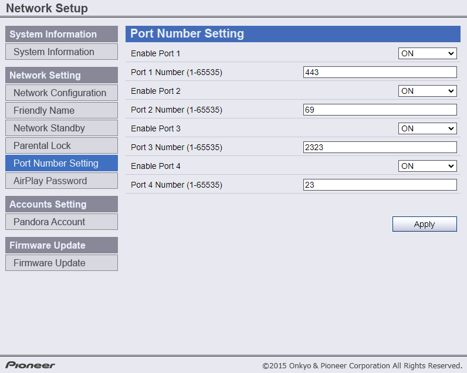

<!DOCTYPE html PUBLIC "-//W3C//DTD XHTML 1.0 Transitional//EN" "http://www.w3.org/TR/xhtml1/DTD/xhtml1-transitional.dtd">
<html xmlns="http://www.w3.org/1999/xhtml">
<head>
<meta http-equiv="Content-Type" content="text/html; charset=utf-8" />
<title>Untitled Document</title>

</head>

<body>
<h1>Pioneer Remote App</h1>

The APKs have been precompiled to autodetect a Pioneer receiver connected to the network via Ethernet or Wifi. Keep in mind you have to be within the same network as the receiver. These Pioneer receivers run a telnet server on port 8102, but can be customized to have different ports available. If you wish to customize your ports, visit the receiver's ip address in a web browser, and change network settings.

&nbsp;

&nbsp;

<h2>Quickstart:</h2>

Clone and cd into the repository. Make sure you have the latest version of Python installed and pip is upgraded. First you'll want to create a virtual enviroment to prevent any errors while running/compiling the app as specified in the <a href="https://kivy.org/doc/stable/gettingstarted/installation.html"><strong>Kivy documentation here.</strong></a> IT'S IMPORTANT TO INSTALL ACCORDING TO THE KIVY INSTRUCTIONS.

After installing kivy in a virtual environment and activating the venv, you can run the app by entering <code>python3 main.py -d</code>. The -d option will enable debugging output to the terminal, so if it fails to launch you have a pretty good idea where it failed.

<h2>Compiling</h2>

&nbsp;

To compile you will need to install buildozer. This will only work in a linux distro, including Windows linux subsystem. <a href="https://buildozer.readthedocs.io/en/latest/installation.html"><strong>PLEASE INSTALL WITH THESE INSTRUCTIONS BEFORE PROCEEDING.</strong></a>

&nbsp;

Install the buildozer project with:

python3 -m  pip install --upgrade buildozer

Run the following, line per line.

  <pre><code>sudo apt update</code></pre>
    <pre><code>sudo apt install -y git zip unzip openjdk-13-jdk python3-pip autoconf libtool pkg-config zlib1g-dev libncurses5-dev libncursesw5-dev libtinfo5 cmake libffi-dev libssl-dev</code></pre>
  <pre><code>python3 -m pip install --upgrade Cython==0.29.19 virtualenv</code></pre>
    
  
# add the following line at the end of your ~/.bashrc file

  <pre><code>export PATH=$PATH:~/.local/bin/</code></pre>

Install the remaining dependencies.

<code>
<pre><code>python -m pip install --upgrade pip</code></pre>
<pre><code>python -m pip install --upgrade wheel</code></pre>
<pre><code>python -m pip install --upgrade cython</code></pre>
<pre><code>python -m pip install --upgrade virtualenv</code></pre>
<pre><code>python -m pip install --upgrade buildozer</code></pre>

Buildozer will try to guess the version of your application, by searching a line like __version__ = “1.0.3” in your main.py. Ensure you have one at the start of your application. It is not mandatory but heavily advised.

Create a buildozer.spec file, with:

<code>

buildozer init

</code>

Edit the buildozer.spec according to the specifications. You should at least change the title, package.name and package.domain in the [app] section.

Start a Android/debug build with:

<code>

buildozer -v android debug

</code>

Now it’s time for a coffee / tea, or a dinner if you have a slow computer. The first build will be slow, as it will download the Android SDK, NDK, and others tools needed for the compilation. Don’t worry, thoses files will be saved in a global directory and will be shared across the different project you’ll manage with Buildozer.

At the end, you should have an APK or AAB file in the bin/ directory.

<h2>Customization</h2>

You can customize the splash.png and icon.png the whatever you want. Size for splash doesn't seem to matter, and the icon can be up to 255x255.

Included in the resources is a shrek image you can obviously replace, or get rid of in line 22 of <strong>pioneerremote.kv</strong>

The <strong>pioneerremote.kv</strong> file can be customized to whatever devices you have connected to the receiver. Just remember to update the dictionary in on line 255 in <strong>main.py. </strong>For example, if you wanted to add a Blueray button in the kv file add:

<code>
<pre class="tabbed">ToggleButton:</pre>
<pre class="tabbed">    group: "input_group"</pre>
<pre class="tabbed">    text : "Blueray"</pre>
<pre class="tabbed">    font_size: "24dp"</pre>
<pre class="tabbed">    state: root.get_input_source(self)</pre>
<pre class="tabbed">    on_release: root.change_input(self)
</pre></code>

In the main.py file you would change line 255 to:

<code>
<pre>selection = {"Chromecast":"04", "Bluetooth":"33","PC":"06","Spotify":"53","TV":"01", "PS4":"05",<mark>"Blueray":"(Add the funtion number here)"</mark>}</pre>
</code>

<h2>Commands</h2>

Commands can be found in <a href="Pioneer-IP-RS232-Commands.pdf">Pioneer-IP-RS232-Commands.pdf</a>

A useful command to run is <code>?f</code> which returns a code like <code>fn06</code> which is the current input the receiver is on. That numeric code is what's used in the <code>selection</code> dictionary in main.py to bind the names of the inputs to their corresponding codes.
</body>
</html>
